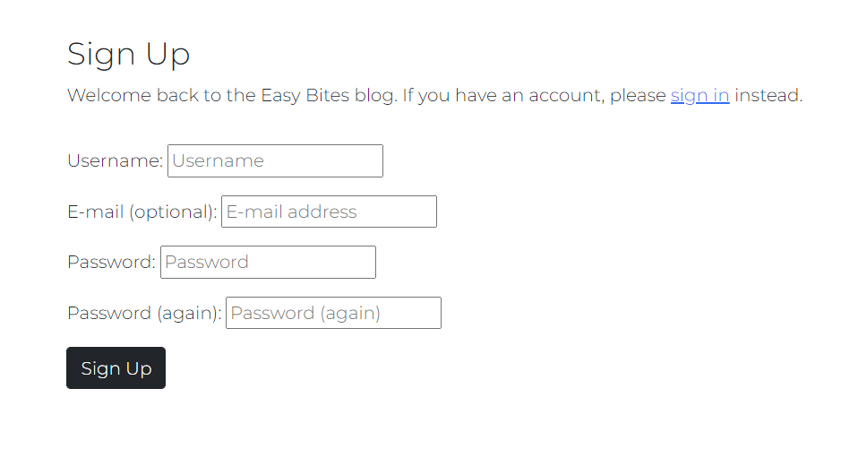
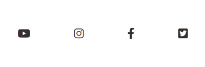

# Introduction

Recipe Blog is a website where users can share their recipes. It was built in Django using Python. Users can create their own account and upload their own recipes. 

## Contents
* [User Experience (UX)](#UX)
    * [User Stories](#User-Stories)
* [Scope](#Scope)
* [Structure](#Structure)
* [Skeleton](#Skeleton)
* [Surface](#Surface)
    * [Colour](#Colour)
    * [Fonts](#Fonts)
* [Features](#Features)
    * [Exsisting Features](#Exsisting-Features)
    * [Future Features](#Future-Features)
* [Technologies Used](#Technologies-Used)
* [Testing](#Testing)
* [Deployment](#Deployment)
    * [Heroku](#Heroku)
    * [Clone](#Clone)
* [Credits](#Credits)
    * [Media](#Media)
    * [Code](#Code)

## UX
Recipe Blog is a simple and user intuitive website for users to share their recipes with others and discover recipes by other users. 

### User Stories 
User Account: 
* Create Account - As a site user I want to create an account to create and save recipes
* Sign In and Sign Out - As a Site User I want to sign in and out of my account so that manage my recipes

Recipe Management:
* Recipe Creation - As a Site User I can create a new recipe to share with others
* Recipe View - As a Site User I can view the recipes on the site so that I can try them at home
* Recipe Edit - As a Site User I can edit a recipe I have created incase I have made any mistakes
* Recipe Deletion - As a Site User I can delete a recipe I have created so that it can be removed from the site

Recipe Views:
* Recipe Instructions - As a Site User I can view the instructions on each recipe so that I can easily follow them
* Multiple Recipe Summary -  As a Site User I would like to be able to view multiple recipces at once so I have a choice as to what recipe I want to try

## Scope
User Account:
* Users can create an account
* Users can sign in and out of their account

Recipes: 
* Users can create, view, edit and delete their recipes 

Recipe Interaction: 
* Users can leave like a recipe. The user needs to be logged in to interact with recipes.

Responsiveness:
* Create a website that is fully responsive for desktop, tablet and mobile.

## Structre 
Home page:
* Features a register/sign in section so the user can create an account and sign in to access different features. 

Recipe Page:
* Features a list of recipes posted by the user and other users. Visible if you are registered or not.

Recipe Steps Page:
* Users can click into a recipe for instructions for the recipes. Like feature is for signed in users only.

## Skeleton
Wireframes

Database

## Surface
Colour 

Fonts 

## Features 
Exisiting Features
### Home Page

* The banner image welcomes users to the site with a message 

### Recipe Page

* The recipe page displays all recipes on the site
* Displays buttons to update recipe, delete recipe and add recipe when logged in

### Recipe Detail Page

* On the recipe page users can see all recipes available on the website, along with the title, author, and description of the recipe. To fully see the recipe users can click on the recipe title

### Like and Back button

* Users can like a recpie and view how many likes are on the recipe. A back button is available for users to return to the recipes page

### Add Recipe Page

* On this page users can fill out the form to add a recipe

* When a user adds a recipe a message pops up at the top of the page letting them know they have successfully added the recipe

### Edit Recipe Page

* On this page users can fill out the form to edit a recipe

* When a user edits a recipe a message pops up at the top of the page letting them know they have successfully edited the recipe

### Delete Recipe Page

* The modal will ask the user if they want to delete the recipe

* Once confirmed a message pops up at the top of the page letting them know they have successfully deleted the recipe

### Signup Page

* On the signup page, a new user can signup for the blof by filling out and submitting the form

* When a user signs up to the site a message pops up at the top of the page letting them know they have successfully signed in

### Login Page

* On the login page, users can login to the site by entering their username and password if they are a registered user

* When a user logs in to the site a message pops up at the top of the page letting them know they have successfully signed in

### Logout Page

* On the logout page, users can confirm that they want to log out of the site

* When a user logs out of the site a message pops up at the top of the page letting them know they have successfully signed out

### Navbar

* The navbar is present on the top of every page
* It displays home, register and login if the user is not logged in

* Once logged in it displays home and logout

### Footer

* The footer displays social media links for the site

Future Features
- Add ability to comment on recipes
- Add ability for users to have a profile where they can view recipes that they have saved, along with uploading a profile image and adding a bio
- Add categories so users can look to see what recipes are on the blog for fish, chicken etc
- Add search bar so users can search for a specific recipe

## Technologies Used
Python 
[Heroku](https://dashboard.heroku.com/) - Deploying the project
[GitHub](https://github.com/) - Hosting code for the project
[Balsamiq](https://balsamiq.com/wireframes/) -  Used for wireframes 
[Font Awesome](https://fontawesome.com/) - Used for icons
[Cloudinary](https://cloudinary.com/) -  Used for storing static data
[Google Fonts](https://fonts.google.com/) - For fonts used in the project
[Bootstrap5](https://getbootstrap.com/) - Used to style and add responsiveness to the site
[TinyPNG](https://tinypng.com/) -  Used for compressing images
[Google Chrome Dev Tools](https://developer.chrome.com/docs/devtools/) - Used for debugging 

## Testing
Testing:
As a site user I want to create an account to add recipes:
- The user can navigate to the navigation bar at the top of the page
- The user can click the register link within the navbar which brings the user to a signup page
- When the user fills out the form they are then alerted that they have signed in successfully

As a site user I want to create a recipe:
- The user can navigate to the home page. If the user is logged in they will see a create recipe button
- This button brings the user to a create recipe form where they can enter the title, author, description and upload an image for the recipe
- The user then clicks the submit button, which then adds the recipe to the home page and alerts the user that the recipe has been added successfully

As a site user I want to update a recipe:
- The user can navigate to the home page.If the user is logged in they will see a update recipe button
- This button brings the user to an edit recipe form where they can enter the title, author, description and upload an image for the recipe
- The user then clicks the submit button, which then edits the recipe and alerts the user that the recipe has been edited successfully

As a site user I want to delete a recipe:
- The user can navigate to the home page. If the user is logged in they will see a delete recipe button
- This button brings the user to a page asking the user if they want to delete the recipe
- Once the user confirms they want to delete the recipe the user is brought back to the home screen and is alerted that the recipe has been deleted successfully

As a site user I want to like a recipe:
- There is a like button at the bottom of the recipe that the user can click on
- The total number of likes on the recipe is shown

As a site user I want to return to the recipes page:
- There is a back button at the bottom of the recipe that brings the user back to the recipe page when clicked

As a site user I want to log out of the site:
- The user can navigate to the navigation bar at the top of the page
- The user can click logout within the navbar which brings the user back to the home page
- The user is alerted that they have logged out successfully 

As a site user I want to login of the site:
- The user can navigate to the navigation bar at the top of the page
- The user can click login within the navbar which brings the user back to the home page
- The user is alerted that they have logged in successfully 

## Deployment 
Heroku
* Go to the Heroku website (https://www.heroku.com/) 
* Login to Heroku and select Create App 
* Click New and Create a new app
* Enter a name and select location
* Click on create new app
* Go to the Settings tab 
* Add all nessecary config vars
* Navigate to the Deploy tab
* Click on Connect to Github and search for the repository
* Navigate to enable automatic deployments and enable
* Navigate to manual deploy and click on deploy branch

Clone
The repository can be cloned by following these steps:
- Log into GitHub and go to the GitHub Repository
- Click on the code button on the right above the files list
- Then select HTTPS and copy the URL
- Open Git Bash
- Change the current working to the location you want the cloned directory to be
- Type git clone and paste the URL from earlier
- Press enter to create the local clone

## Credits
Media 
Recipes from
* [here](https://www.bbcgoodfood.com/recipes/pizza-margherita-4-easy-steps)
* [here](https://www.bbcgoodfood.com/recipes/gyoza)
* [here](https://www.bbcgoodfood.com/recipes/chocolate-muffins)
* [here](https://www.bbcgoodfood.com/recipes/air-fryer-chicken-thighs)
* [here](https://www.bbcgoodfood.com/recipes/one-pot-tomato-orzo)

Banner image was taken from [Unsplash](https://unsplash.com/)

Content 
* Pagination was taken and adapted from [here](https://docs.djangoproject.com/en/4.2/topics/pagination/)
* Form was inspired from [here](https://docs.djangoproject.com/en/4.2/topics/forms/) and [here](https://www.geeksforgeeks.org/django-forms/)