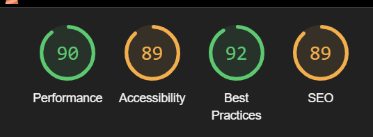

Back to [README.MD](README.md)

# Testing
Testing:
As a site user I want to create an account to add recipes:
- The user can navigate to the navigation bar at the top of the page
- The user can click the register link within the navbar which brings the user to a signup page
- When the user fills out the form they are then alerted that they have signed in successfully

Tested & outcome: Pass

As a site user I want to create a recipe:
- The user can navigate to the home page. If the user is logged in they will see a create recipe button
- This button brings the user to a create recipe form where they can enter the title, author, description and upload an image for the recipe
- The user then clicks the submit button, which then adds the recipe to the home page and alerts the user that the recipe has been added successfully

Tested & outcome: Pass

As a site user I want to update a recipe:
- The user can navigate to the home page.If the user is logged in they will see a update recipe button
- This button brings the user to an edit recipe form where they can enter the title, author, description and upload an image for the recipe
- The user then clicks the submit button, which then edits the recipe and alerts the user that the recipe has been edited successfully

Tested & outcome: Pass

As a site user I want to delete a recipe:
- The user can navigate to the home page. If the user is logged in they will see a delete recipe button
- This button brings the user to a page asking the user if they want to delete the recipe
- Once the user confirms they want to delete the recipe the user is brought back to the home screen and is alerted that the recipe has been deleted successfully

Tested & outcome: Pass

As a site user I want to like a recipe:
- There is a like button at the bottom of the recipe that the user can click on
- The total number of likes on the recipe is shown

Tested & outcome: Pass

As a site user I want to return to the recipes page:
- There is a back button at the bottom of the recipe that brings the user back to the recipe page when clicked

Tested & outcome: Pass

As a site user I want to log out of the site:
- The user can navigate to the navigation bar at the top of the page
- The user can click logout within the navbar which brings the user back to the home page
- The user is alerted that they have logged out successfully 

Tested & outcome: Pass

As a site user I want to login of the site:
- The user can navigate to the navigation bar at the top of the page
- The user can click login within the navbar which brings the user back to the home page
- The user is alerted that they have logged in successfully

Tested & outcome: Pass

## Layout
The project has been adapted to all types of devices using Bootstrap predefined breakpoints. 

## Perfomance
The performance of the website was tested using [Lighthouse](https://developer.chrome.com/en/docs/lighthouse/)

* Home Page

* Login Page

* Recipe Page

* Signup Page

## Validation
## HTML
The HTML of the website was validated using [W3 Markup Validator](https://validator.w3.org/)
At the time of deployment this is the outcome

## CSS
The HTML of the website was validated using [W3 Jigsaw Validator](https://jigsaw.w3.org/css-validator/)
At the time of deployment this is the outcome

## Python
I used the built in linter in Gitpod to test the Python code.

The only errors showing in the linter are that the lines are too long, the longest being 89 characters. I have ignored this as I would have to break the code and make it difficult to read.

## Bugs
### Recipe Image
When implementing an image on the recipe card the placeholder image would only appear. When trying to upload my own image as part of adding a recipe the image would never show. For this reason I left it out of the recipe. However I still have the featured image field in my model as I would like to come back to try and fix it and have left it there as to not potentionally mess with the database by removing it and readding it.

### Delete Recipe Alert
When deleting a recipe the user was brought to a page asking them if they wanted to delete their recipe. Somewhere along the way this stopped working and users were only being alerted that they were successfully deleting the recipe and not asking them beforehand if they wanted to. To fix this I added in a modal that is triggered when the user clicks on the delete recipe button. On reflection this looks and functions better on the site.

### Like button
When liking and unliking a recipe, the page reloads. I have not figured out how to fix this, and while it is nothing major the user may find it annoying and that is why it is being considered a bug.

Back to [README.MD](README.md)

